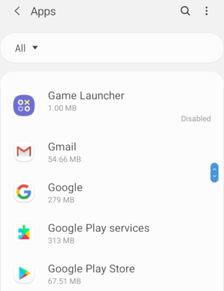

# Review Installed Applications

Some malicious applications are presented as legitimate applications, often being a copy of a legitimate application with malicious code added to them. In that case, they still need an important number of Android permisions to be able to monitor your phone remotely, so a first step is to check the list of applicaitons installed and their permissions.

To do that, visit **Settings > Applications**

This menu is showing you a list of all the applications installed. You should visit the page of each of these applications and check for the permissions allowed for them.

The following permissions are specifically suspicious as they are very regularly used by malicious applications :
* Location
* Contacts
* SMS
* Microphone
* Camera
* Call logs
* Phone

It is also interesting to check other paremeters about this app, that may or may not be displayed depending on your version of Android :
* Check if the app was installed from the Google Play store : see **App details** or **App details in store**
* Check if the app can modify system settings : see **Modify system settings** or **Change system settings**
* Check if the app is allowed to install other applications : see **Install unknown apps**
