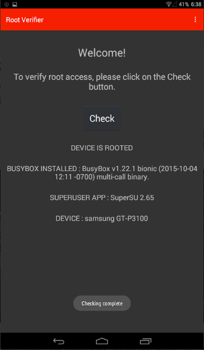

# Check if the Phone is Rooted

## Look for Root-Related Applications

When a phone is rooted, the process often involves installing an application to manage root access, most of the time [SuperSU](http://www.supersu.com/). One first step is to check if the SuperSU application is installed. You can check directly for the icon in your main menu, or go to **Settings > Applications** and search the application.

## Check with Root Verifier

Root Verifier is an [open source](https://github.com/abcdjdj/RootVerifier-APP) application that check if an Android Phone is rooted through different techniques. You can install it from the [Google Play Store](https://play.google.com/store/apps/details?id=com.abcdjdj.rootverifier) or from the [F-Droid repository](https://f-droid.org/packages/com.abcdjdj.rootverifier/).

Once installed, you can launch the application. The interface is really simple, you just need to click on "CHECK" and wait for the result.

