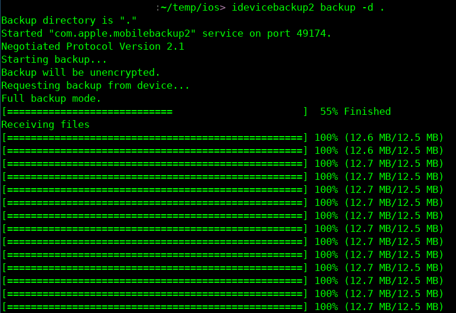

# Extract Data for Further Analysis

[libimobiledevice](http://www.libimobiledevice.org/) is a cross-platform software library that allows to interact with iOS devices.

## Install

libimobiledevice has packages for OpenSUSE, Fedora, Debian and Ubuntu Linux distributions, just do **apt install libimobiledevice** (or equivalent package manager).

On MAC OS, the easiest way is to install the [HomeBrew package manager](https://brew.sh/), and then install libimobiledevice with it with **brew install ideviceinstaller**

There is currently no easy way to install libimobiledevice on Windows, you will have to [manually compile it on your system](https://github.com/libimobiledevice/libimobiledevice/issues/582).

## Extract the Backup

Once libimobiledevice is installed, connect your iphone to your computer and accept the notification asking if your phone should trust the computer connected.

You can then check if the device is correctly connected with the computer with **idevice_id -l** :

```
> idevice_id -l
6ff8a10037495eaf054018ed79fbf0e7e3c5bc2f
```

You can then do a backup of the system with the command **idevicebackup2 backup -d FOLDER**.



## Extract Data to a Readable Format

The data extracted by libimobile device are not in a readable format, to convert them into data as they are on the phone, you have to use another tool like [ideviceunback](https://github.com/inflex/ideviceunback).

First you need to download it and install it :
```
$ git clone https://github.com/inflex/ideviceunback.git
$ make
```

You can now extract the files from the backup :

```
./ideviceunback -v -i path/to/backup -o output/path
```
