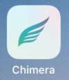

# Check for Jailbreaks

In order to install spyware on an iOS device, attackers need to exploit vulnerabilities in the operating system. Apple has made this task significantly harder over the years, and such exploits have become more difficult and more expensive to produce. Remote Exploits (attacking, for example, [WhatsApp](https://www.engadget.com/2019/05/13/whatsapp-call-exploit-allowed-spyware), iMessage or Safari) are particularly rare and costly, and are only accessible to resourceful attackers, typically governments. In the case that an iOS device was indeed compromised with a private, commercial-grade sophisticated exploit, it is likely the case that the only check you can perform is of the outgoing [network traffic](../network.md).

Jailbreaks are exploits for mobile devices, in this case iPhones and iPads, that are typically installed manually on the phone and which disable certain security features of iOS. New [jailbreaks are regularly made available to the public](http://theiphonewiki.com/wiki/jailbreak) and attackers might use them if the target devices are of the right model and version of iOS. At the time of writing, there are public jailbreaks available for iOS up to version 12.4.

Because regular users typically would not (and should not) install jailbreaks on their iPhones and iPads, if the device you are testing shows appears jailbroken it is a very credible sign of a potential compromise. Following are some of the traces that might be left behind by a public jailbreak.

## Look for any jailbreak-related applications icons

During the process of jailbreaking the phone, several applications are often installed, either to jailbreak the phone (like [unc0ver](https://github.com/pwn20wndstuff/Undecimus) or [Chimera](https://chimera.sh/)) or to install applications (such as [Cydia](https://cydia.saurik.com/) or [Sileo](https://getsileo.app/)). A first step to identify a jailbroken iPhone is to check for one of these apps on the phone :

| App | Logo |
|---|---|
| Cydia |  |
| Sileo |  |
| unc0ver |  |
| Chrimera |  |
| Electra |  |

## Scan the phone for open ports

Many jailbreak tools install a ssh server by default during the operation. It is then possible to detect if the server is running by checking open ports on the iPhone from another computer on the same network.

To do that, you first need to get the iPhone IP address, go Settings > Wifi > Your network, and get the value in the "IP Address" field (something like 192.168.0.1).

From another computer on the same network, you need to use a port scanner such as [nmap](https://nmap.org/) and scan the ports on the iPhone with it. For instance with nmap through command-line :

```
# nmap 192.168.186.196
Starting Nmap 7.70 ( https://nmap.org ) at 2019-11-07 00:07 CET
Nmap scan report for iPhoneRobert.lan (192.168.186.196)
Host is up (0.0041s latency).
Not shown: 998 closed ports
PORT      STATE SERVICE
22/tcp    open  ssh
62078/tcp open  iphone-sync

Nmap done: 1 IP address (1 host up) scanned in 41.18 seconds
```

In this scan, we see that ssh is running on port 22 (its default port), so it means that the iphone is jailbroken.

## Try to mount the full filesystem

In many cases, jailbreaking the device will also install by default the AFC2 service that allows to mount the root filesystem from an external computer connected through USB. You can test if the root filesystem of the iPhone can be mounted by using the [ifuse](https://github.com/libimobiledevice/ifuse) tool.

You first need to download the source code and install it on your Linux or MacOSX system as explained in [this page](https://github.com/libimobiledevice/ifuse/wiki).

Once installed, you have to accept that the phone trust the computer and can just run `ifuse --root FOLDER`.

If the phone is jailbroken with the AFC2 service running, the root filesystem will be mounted directly to the given folder :
```
> ifuse --root mount/
> ls mount
Applications  boot   dev        etc  lib      mnt      sbin    tmp   usr
bin           cores  Developer  jb   Library  private  System  User  var
```

If the phone is not jailbroken or if AFC2 is not running on it, you will see the following error message :
```
> ifuse --root mount/
Failed to start AFC service 'com.apple.afc2' on the device.
This service enables access to the root filesystem of your device.
Your device needs to be jailbroken and have the AFC2 service installed.
```
