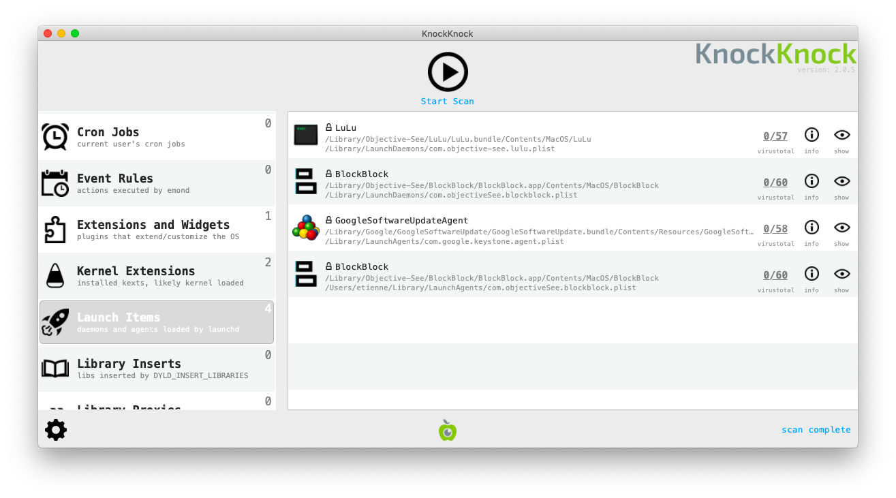
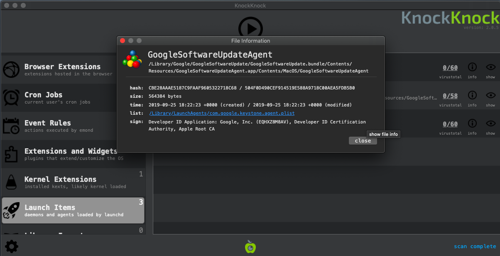
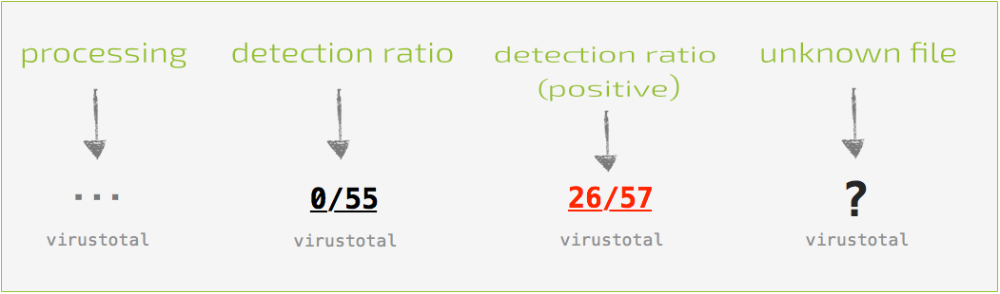

# Review Programs Launching at Startup

Most spyware need to find a way to run on start-up when a computer is restarted. It is thus interesting to review the list of program running on startup to identify potential malware. The program [KnockKnock](https://objective-see.com/products/knockknock.html) developed by Objective-See allows to list these programs.

## Launching KnockKnock

You first need to download the program from [its official page](https://objective-see.com/products/knockknock.html), then unzip the archive containing the program (double-clicking on it should work in most cases) and double-click on the KnockKnock program to launch it.

Once launched, you need to press the `Start Scan` button. KnockKnock will then scan known locations where persistent software or malware may be installed and check if they are known by [VirusTotal](https://www.virustotal.com/).

## Analyzing Results

KnockKnock does not automatically determine which programs are malicious or not. As with the rest of this [methodology](methodology.md), it is necessary for you to eventually become familiar enough with its results to quickly spot any anomalies or entries that you do not recognize. It is also important that you talk with the system owner to identify which programs are unknown to them.

Following are some suggestions of patterns to look out for.

### 1. Verify Image Signatures

In modern versions of Mac OS, legitimate applications are generally required to be "signed" with a developer certificate. Such certificates allow to verify the producer of a particular program (such as Google, Adobe, or else). Applications that are not signed normally are more controlled and scrutinized by Mac OS security mechanisms. A useful first check is to verify whether an application is signed or not. To view the application signature, you have to click on the `(!) Info` icon on the right of the Application name. Please note that by default, Apple-signed programs are filtered out.

### 2. Check Program Names and Paths

KnockKnock shows the name that was given to the application by its developers. This information can be faked, but sometimes attackers are lazy enough to either mispell spoofed legitimate names (e.g. "Micorsoft Ofice" or "Crhome") or to just leave random characters and numbers.

MacOS applications are typically installed in a few folders depending on the type of application. Seeing an application running on startup from a non-standard folder does not mean it is malicious but is definitely suspicious and should be checked more in depth.

Here are the standard folders :

* Browser extensions are typically running from `/Users/<username>/Library/Application Support`
* Kernel Extensions : `/Library/Extensions` or `/System/Library/Extensions/`
* Other applications : `/Library` and `/Applications`

### 3. Check VirusTotal Scan Results

During the scan, KnockKnock is checking the fingerprint of applications running on startup over the [VirusTotal](https://virustotal.com/) database and showing the result in the menu.

Any file identified as malicious y at least one antivirus in VirusTotal should be checked (although there are some false positive, keep that in mind if a very small number of antiviruses only are detecting it as malicious). A file not known by VirusTotal is also suspicious as their database contains most common legitimate applications.

**Please note:** [As discussed](safety.md), under normal circumstances you would prefer to not connect the tested computer to the Internet. Without an Internet connection, you are not able to immediately check with VirusTotal. However, it is possible to save KnockKnock results clicking *Settings* > *save scan results* and later open the results from a separate computer with Internet connection.

