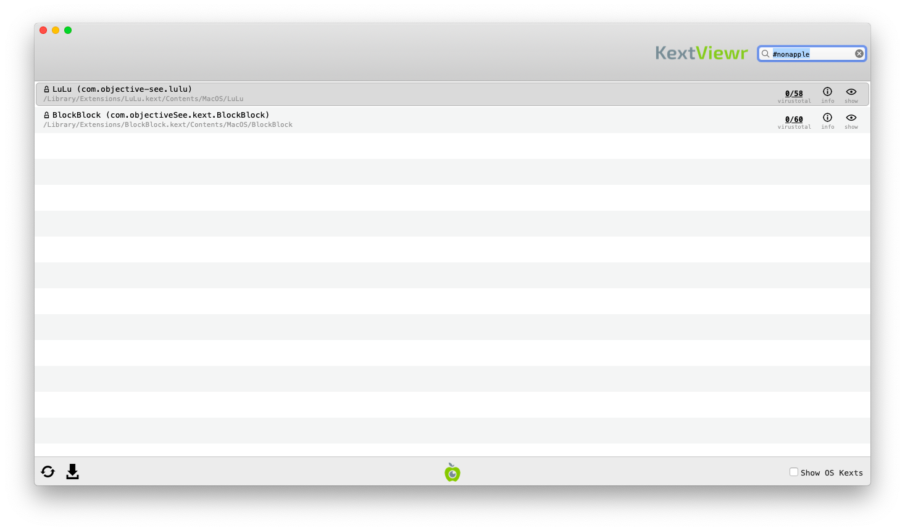

# Review Kernel Extensions

Kernel extensions (often called kexts) are programs extending the features of the MacOS kernel and as such they are running with the highest privilege, which make them interesting for malware. The tool [KextViewr](https://objective-see.com/products/kextviewr.html) developed by Objective-See allows to list all loaded kernel extensions.

## Launching Kext Viewer

To launch KextViewr, download it first from [its official page](https://objective-see.com/products/kextviewr.html). Then extract the program from the archive and double click on it :

## Analyzing Results

### 1. Verify Image Signatures

Similarly than with other tools, KextViewr displays the signature status with a icon near the name, a green locked icons  means that the extension is signed by Apple, a closed black lock  means that the extension is signed by another company while an open orange lock  means that the extension is not signed.

To view only 3rd party kernel extensions, you can uncheck the `Show OS Kexts` checkbox at the bottom of KextViewr window.

### 2. Check Program Names Paths

As with previous steps, you should check kexts name and paths. The name should give you an indication of the utility of the kext, any typo or random string here is suspicious.

For the extension paths, OS Kexts should run from `/System` while non-OS Kexts should run from `/Library`.

### 3. Check VirusTotal Scan Results

KextViewr also checks file fingerprint on VirusTotal. On the right of each task running, you will see two numbers representing first the number of antiviruses that identified this file as malicious and then the total number of antiviruses tested. An question mark will appear if this program is not known by VirusTotal.

You should investigate further any task identified by at least one antivirus as malicious or not known by VirusTotal.

**Please note:** the same considerations and warnings explained in the [previous section](autoruns.md) apply here too. Make sure to read them before proceeding.

