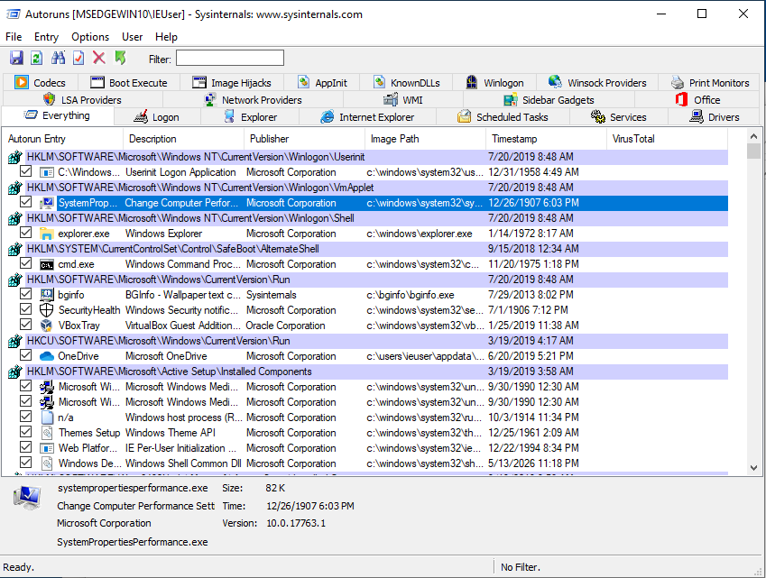
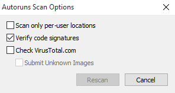
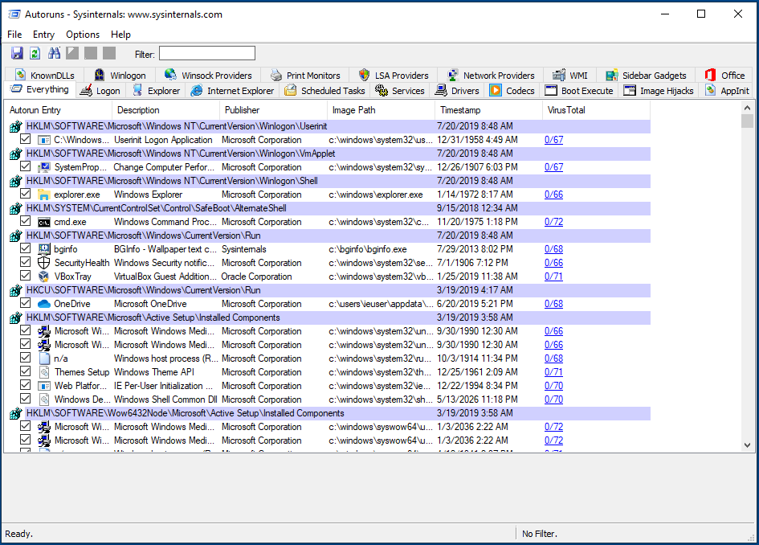

# Review Programs Launching at Startup

Normally, spyware needs to find a way to run on start-up when a computer is restarted. Reviewing applications starting automatically is thus one of the first checks to perform when looking for potential infections. Windows computers have different ways to enable automatic launch, and spyware often use tricks to appear legitimate and/or avoid the most common methods.

[Sysinternals Autoruns](https://technet.microsoft.com/en-ca/sysinternals/bb963902.aspx) is a tool that allows to exhaustively list programs running on start-up. If possible, you should run this program as Administrator:

All results will be displayed by default in the main tab. Clicking through the other available tabs will filter the results by the respective auto-launch type. The most interesting ones generally would be `Logon`, `Scheduled Tasks`, `Services`.

## Looking for suspicious patterns

Autoruns does not automatically determine for you which file are malicious and which not. As with the rest of this [methodology](methodology.md), it is necessary for you to eventually become familiar enough with its results to quickly spot any anomalies or entries that you do not recognize. However, Autoruns can provide some useful indications.

Sometimes, Autoruns might flag a particular row with a red background. These might warrant further inspection, as it might be a sign of an unusual entry. Entries marked with a yellow background instead refer to files that do no longer exist on the computer. These entries are therefore broken.

Following are some suggestions on patterns to look out for.

### 1. Verify image signatures

In modern versions of Windows, legitimate applications are generally required to be "signed" with a developer certificate. Such certificates allow to verify the producer of a particular program (such as Microsoft, Google, Adobe, or else). Applications that are not signed normally are more controlled and scrutinized by Windows security mechanisms (such as its embedded antivirus, Windows Defender). A useful first check is to verify whether all applications launching automatically are indeed signed, and this can be done by clicking *Options* > *Scan Options* and enabling *Verify code signatures*.

This will relaunch Autoruns' scan and will add a new column called "Publisher". Correctly signed applications will be marked as "(Verified)":

**Beware**: Not all verified Autorun Entries are necessarily safe. Sometimes attackers purposefully abuse legitimate verified applications in order to appear less suspicious, and use them as launchers to then load and execute malicious code. This is sometimes done using, for example, Microsoft `rundll32.exe` or other applications affected by what's known as [DLL Sideloading](https://attack.mitre.org/techniques/T1073/).

### 2. Check the name of the Autorun Entry

Autorun Entry show the name that was given to the application by its developers. This information can be faked, but sometimes attackers are lazy enough to either mispell spoofed legitimate names (e.g. "Micorsoft Ofice" or "Crhome") or to just leave random characters and numbers.

### 3. Check the program description

Similarly, this is not a reliable indicator, but legitimate applications should generally have a program description visible.

### 4. Check the Image Path

Windows provides some standard folders where legitimate applications are normally installed and run from. Services from the operating system itself are normally located under `C:\Windows\`, while user-installed applications are generally located under `C:\Program Files\` or `C:\Program Files (x86)\`. Because installing programs in those folder should require some confirmation from the user, attackers often place their malicious files in less typical folders, such as `C:\Users\<Username>\AppData\` or other subfolders in `C:\Users\`.

Example of suspicious entries:

- The [KeyBoy spyware](https://citizenlab.ca/2016/11/parliament-keyboy/) creates a Registry Key in `HKEY_CURRENT_USER\SOFTWARE\Microsoft\Windows NT\CurrentVersion\Winlogon\shell` with the value `explorer.exe,C:\Windows\system32\rundll32.exe "%LOCALAPPDATA%\cfs.dal" cfsUpdate`
- A particular malware used in Central Asia relies on the use of VBScripts, which are highlighted by Autoruns with a red background, pretending to be Adobe and Google software. These results would definitely warrant further inspection. In addition, the scripts are located under `C:\Users\<Username>\AppData\`:

### Optional: 5. Looking up programs on VirusTotal

Optionally Autoruns allows to check binary files against [VirusTotal](https://www.virustotal.com/gui/home/upload), which helps to immediately identify any malicious program that is well-known and widely detected by Antivirus software (read more about this in the section below). To enable this check, go in *Options* > *Scan Options* and enable "*Check VirusTotal.com*". Be careful not to enable "*Submit Unknown Files*", as it would make Autoruns automatically upload the local files to the service, rather than just looking up their cryptographic hashes. VirusTotal is a company, now owned by Alphabet (Google's parent company), and it provides commercial access to its data to security researchers and customers all around the world. Those with access to VirusTotal commercial services are able to look-up and download any uploaded file. Therefore, you might want to avoid inadvertedly submitting any files that might be confidential.

Once the VirusTotal option is enabled, it will take some time for results to appear. Eventually, you should see a VirusTotal column displaying the Antivirus scan results. The results appear as a *X/Y* value, where *X* is the number of positive detections and *Y* is the total amount of Antivirus software the file was scanned with.

If no result is displayed, it means that that particular program has not been previously uploaded to VirusTotal, and it might warrant additional inspection. Sometimes, you wil see some applications with a low detection number (1 or 2): often these are false positives. VirusTotal results showing a higher detection number (for example, 5 and above) is generally a reliable sign that that particular application is malicious. Clicking on the link from the *X/Y* will open up the browser to the VirusTotal analysis, where you can see more details, such as any malware identifiers used by the Antivirus software supported.

**Please note:** [As discussed](safety.md), under normal circumstances you would prefer to not connect the tested computer to the Internet. Without an Internet connection, you are not able to immediately check with VirusTotal. However, it is possible to save Autoruns results clicking *File* > *Save...* and later open the results from a separate computer with Internet connection.
