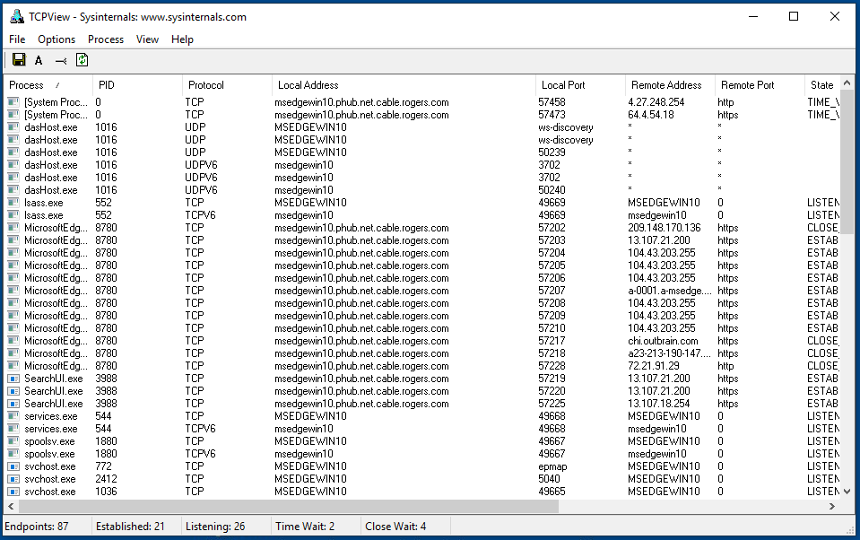

# Review Network Connections

[TCPView](https://technet.microsoft.com/en-us/sysinternals/tcpview.aspx) allows to look for suspicious network communications.

Check for any process with a suspicious connection, like an unknown process communicating on an unusual port.
