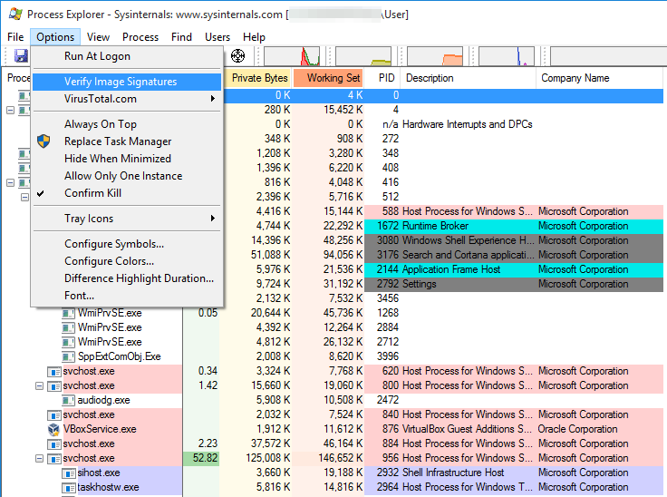
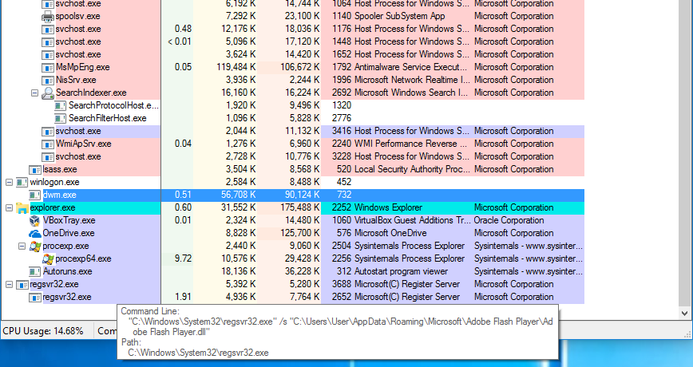
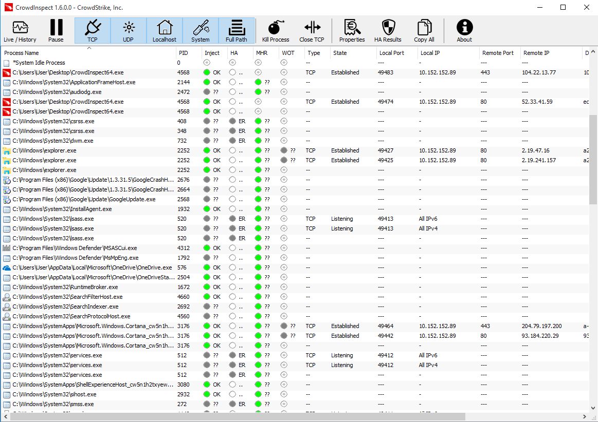

# Review Running Processes

A computer infected with spyware should have some malicious processes running at all times, monitoring the system and collecting data to be transmitted to the [Command & Control server](https://securitywithoutborders.org/resources/digital-security-glossary.html#cnc) of the attackers. Therefore, another required step in triaging a suspected Windows computer is to extract the list of running processes and find if any of them display suspicious characteristics.

There are a couple of tools available in order to do this.

**Warning:** more sophisticated spyware might be capable of evading this tool by either hiding its own entries from the tree, or by perhaps terminating immediately if they observe any of these tools being launched. In this guide we provide some initial methodology and suggestions to perform an initial assessment. A clean process list is not necessarily a guarantee of a clean system.

Before proceeding with this check, it is advisable that you close all visible running applications, in order to reduce the outputs of the tools you will run to the bare minimum.

## Process Explorer

[Process Explorer](https://technet.microsoft.com/en-us/sysinternals/processexplorer.aspx) is another tool from the [Sysinternals Suite](https://docs.microsoft.com/en-us/sysinternals/downloads/sysinternals-suite) by Microsoft, and it lists all the processes running on the system in a tree:

The methodology to check for suspicious running processes is somewhat similar to what we described in the [Review Programs Launching at Startup](autoruns.md) section.

### 1. Verify image signatures

Similarly to Autoruns, Process Explorer also allows to verify signatures of applications running by clicking *Options* and enabling "*Verify Image Signatures*". The same considerations and warnings we described in the [previous section](autoruns.md) apply here too. Even more so with running processes, the fact that a process application is signed does not necessarily mean it is safe. Malware often makes use of techniques such as [Process Hollowing](https://attack.mitre.org/techniques/T1093/) or [DLL Sideloading](https://attack.mitre.org/techniques/T1073/) in order to execute code from inside the context of a legitimate and signed application in order to thwart detection.

### 2. Look for Scripts

Attackers these days often make use of Microsoft Windows scripting capabilities, such as PowerShell and Windows Script Host, because of their flexibility and even ability to evade detection. These scripting engines are commonly used by enterprise customers to automate configurations of internal systems. It is less common to see consumer applications use them, therefore any related processes running should be further inspected.

These processes normally would be called `powershell.exe` or `wscript.exe`.

Following is an example of Process Explorer displaying an obviously malicious PowerShell script running on the system:

Hovering with the cursor over the process name shows the command-line arguments where we can clearly see the script is attempting to download and execute some additional code. Notice also the use of variating lower and upper case, such as "doWnLoAdfile": this is a very basic trick attackers use to evade equally basic detection patterns by security software.

### 3. Look for running DLLs

Malware sometimes also comes in the form of a [Dynamic Link Library (DLL)](https://support.microsoft.com/en-us/help/815065/what-is-a-dll) which, opposite to a standalone application (in other words, a `.exe` file), needs to be launched by a loader. Windows provides a few programs to launch DLLs, commonly `regsvr32.exe` and `rundll32.exe`, which are signed by Microsoft.

Look out for any of those processes running, and try to determine what DLL file they are executing. For example, in the screenshot below, we can see an infected Windows system running a malicious DLL file located under `C:\Users\<Username>\AppData\` using `regsvr32.exe`.

### 4. Look for processes of applications that should be visible

Among the many techniques often used by attackers there is, for example, [Process Hollowing](https://attack.mitre.org/techniques/T1093/). Process Hollowing consists in launching a legitimate application (such as Internet Explorer or Google Chrome), emptying its memory and replacing it with malicious code, which will then be executed. This is normally done to hide the malicious code, make it appear as a legitimate application (which would then only be an empty shell), evade applications firewall and perhaps evade some other security products.

For exampe, if you see a running `iexplore.exe` process, when there is obviously no open Internet Explorer window, you should consider this a worrying sign.

### Optional: 5. Looking up programs on VirusTotal

Similarly to [Autoruns](autoruns.md) section, Process Explorer also offers to look-up running processes on VirusTotal by searching the cryptographic hash of the respective executable files. This can be enabled by clicking *Options* > *VirusTotal.com* and enabling *Check VirusTotal.com*.

**Please note:** the same considerations and warnings explained in the [previous section](autoruns.md) apply here too. Make sure to read them before proceeding.

## CrowdInspect

[CrowdInspect](https://www.crowdstrike.com/resources/crowdinspect/) is a tool produced by the American security company CrowdStrike. CrowdInspect is very similar to Process Explorer, but it has some advantages. Firstly, the information presented tends to be more compact. Secondly, it does not only show currently live processes, but it also can show processes that have terminated since it launch (that you might have perhaps missed because they executed too quickly). Lastly, it performs a number more checks that Process Explorer currently does not support.

### Check for any process injections

Probably the most interesting feature CrowdInspect introduces, is the ability to identify any [injected processes](https://attack.mitre.org/techniques/T1055/). Process injection is a category of techniques whose objective is run malicious code within the context of a separate, generally legitimate, application (such as `explorer.exe`). Process injection is often used by malware authors in order to obtain additional privileges on the system or, for example, to evade detection.

CrowdInspect will alert you of any injected processes by displaying a visible red dot under the "*Inject*" column. Injected processes are generally a very good indicator that there might be an active infection on the tested computer.

