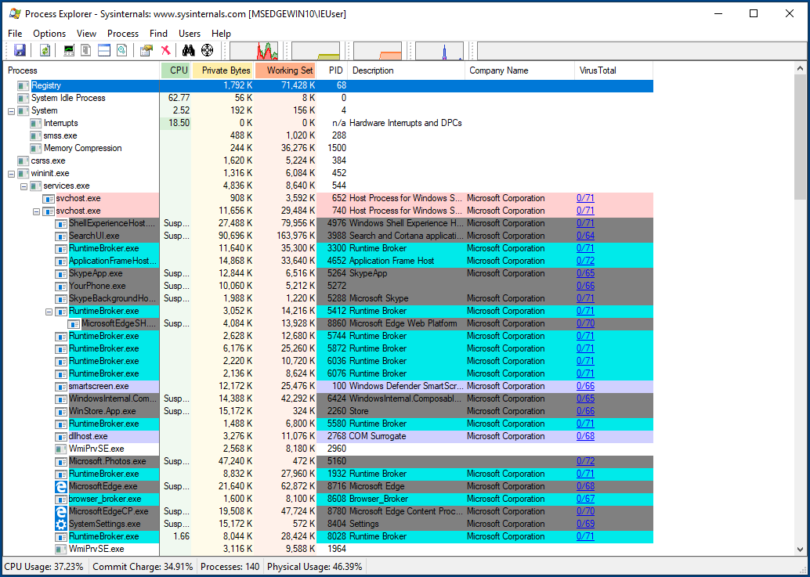

# Review Running Processes

A computer infected with spyware should have some malicious processes running at all times, monitoring the system and collecting data to be transmitted to the [Command & Control server](https://securitywithoutborders.org/resources/digital-security-glossary.html#cnc) of the attackers. Therefore, another required step in triaging a suspected Windows computer is to extract the list of running processes and find if any of them display suspicious characteristics.

There are a couple of tools available in order to do this.

**Warning:** more sophisticated spyware might be capable of evading this tool by either hiding its own entries from the tree, or by perhaps terminating immediately if they observe any of these tools being launched. In this guide we provide some initial methodology and suggestions to perform an initial assessment. A clean process list is not necessarily a guarantee of a clean system.

## Process Explorer

[Process Explorer](https://technet.microsoft.com/en-us/sysinternals/processexplorer.aspx) is another tool from the [Sysinternals Suite](https://docs.microsoft.com/en-us/sysinternals/downloads/sysinternals-suite) by Microsoft, and it lists all the processes running on the system in a tree:

Process Explorer should directly check the file hashes on VirusTotal, it is a good first step to identify suspicious processes. Then you should look for :
* Every program running from user directory (C:\Documents and Settings\USERNAME or C:\Users\USERNAME) is suspicious, especially the programs running from AppData
* Check for program with a name very close to a legitimate Windows process but with a small difference (lass.exe instead of lsass.exe…)
* Check for programs with a legitimate windows name (svchost.exe) outside of standard Windows directories
